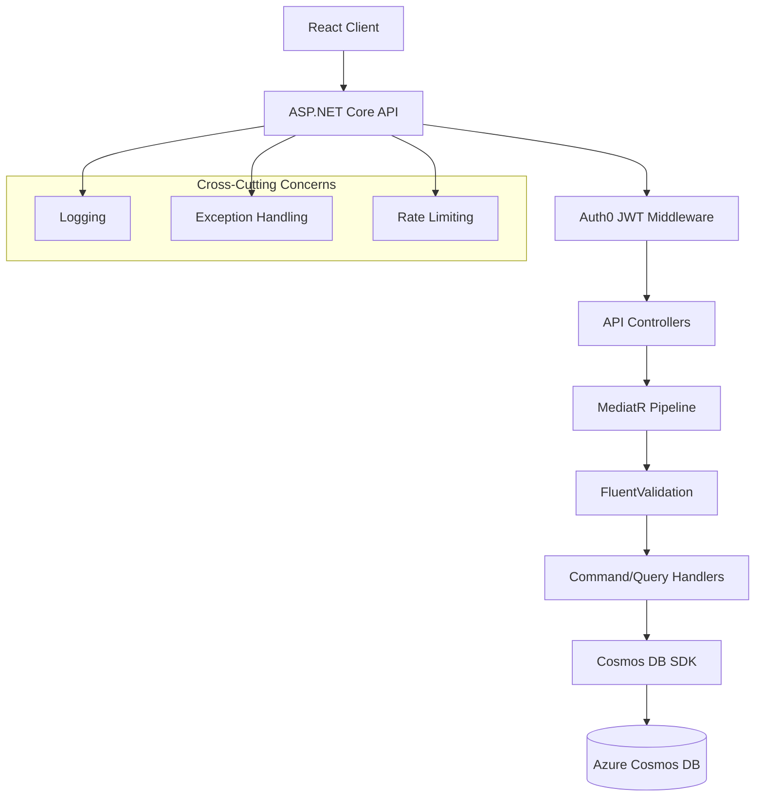

# Backend Architecture - ASP.NET Core 8 REST API

## Overview

This document outlines the architecture for the Budget Manager ASP.NET Core 8 REST API using CQRS pattern with MediatR, FluentValidation, Azure Cosmos DB SDK, and Auth0 JWT authentication.

**Technology Stack:**
- ASP.NET Core 8 (Web API)
- MediatR 12.x (CQRS pattern)
- FluentValidation 11.x (Request validation)
- Azure Cosmos DB SDK 3.x (Direct Cosmos integration, no EF Core)
- Auth0 (JWT authentication)
- Swagger/OpenAPI (API documentation)
- xUnit + FluentAssertions (Testing)

## Architecture Diagram



## Project Structure

```
BudgetManager.Api/
├── Controllers/                    # API Controllers (thin, delegate to MediatR)
│   ├── AccountsController.cs
│   ├── CategoriesController.cs
│   ├── TransactionsController.cs
│   ├── PlannedItemsController.cs
│   └── UsersController.cs
├── Features/                       # Feature-based organization (CQRS)
│   ├── Accounts/
│   │   ├── Commands/
│   │   │   ├── CreateAccount/
│   │   │   │   ├── CreateAccountCommand.cs
│   │   │   │   ├── CreateAccountCommandValidator.cs
│   │   │   │   └── CreateAccountCommandHandler.cs
│   │   │   ├── UpdateAccount/
│   │   │   ├── DeleteAccount/
│   │   │   └── ArchiveAccount/
│   │   └── Queries/
│   │       ├── GetAccounts/
│   │       │   ├── GetAccountsQuery.cs
│   │       │   └── GetAccountsQueryHandler.cs
│   │       ├── GetAccountById/
│   │       └── GetDashboardAccounts/
│   ├── Categories/
│   │   ├── Commands/
│   │   └── Queries/
│   ├── Transactions/
│   │   ├── Commands/
│   │   │   ├── CreateExpense/
│   │   │   ├── CreateIncome/
│   │   │   ├── CreateTransfer/
│   │   │   ├── UpdateTransaction/
│   │   │   └── DeleteTransaction/
│   │   └── Queries/
│   │       ├── GetTransactions/
│   │       ├── GetTransactionsByMonth/
│   │       ├── GetTransactionsByAccount/
│   │       └── GetTransactionsByCategory/
│   ├── PlannedItems/
│   │   ├── Commands/
│   │   └── Queries/
│   └── Users/
│       ├── Commands/
│       └── Queries/
├── Domain/                         # Domain models (matching Cosmos schema)
│   ├── Entities/
│   │   ├── User.cs
│   │   ├── Account.cs
│   │   ├── Category.cs
│   │   ├── Transaction.cs
│   │   └── PlannedItem.cs
│   ├── Enums/
│   │   ├── TransactionType.cs
│   │   ├── CategoryType.cs
│   │   └── PlannedItemType.cs
│   └── ValueObjects/
│       ├── AccountType.cs
│       └── DateRange.cs
├── Infrastructure/                 # Infrastructure concerns
│   ├── Cosmos/
│   │   ├── CosmosDbService.cs     # Cosmos DB SDK wrapper
│   │   ├── CosmosDbSettings.cs
│   │   ├── Repositories/
│   │   │   ├── IAccountRepository.cs
│   │   │   ├── AccountRepository.cs
│   │   │   ├── ITransactionRepository.cs
│   │   │   ├── TransactionRepository.cs
│   │   │   ├── ICategoryRepository.cs
│   │   │   ├── CategoryRepository.cs
│   │   │   ├── IPlannedItemRepository.cs
│   │   │   ├── PlannedItemRepository.cs
│   │   │   ├── IUserRepository.cs
│   │   │   └── UserRepository.cs
│   │   └── Extensions/
│   │       └── CosmosExtensions.cs
│   ├── Auth/
│   │   ├── Auth0Settings.cs
│   │   └── AuthorizationPolicies.cs
│   └── Logging/
│       └── LoggingExtensions.cs
├── Middleware/                     # Custom middleware
│   ├── ExceptionHandlingMiddleware.cs
│   ├── RequestLoggingMiddleware.cs
│   └── UserContextMiddleware.cs
├── Common/                         # Shared code
│   ├── Behaviors/                  # MediatR pipeline behaviors
│   │   ├── ValidationBehavior.cs
│   │   ├── LoggingBehavior.cs
│   │   └── PerformanceBehavior.cs
│   ├── Exceptions/
│   │   ├── NotFoundException.cs
│   │   ├── ValidationException.cs
│   │   └── UnauthorizedException.cs
│   ├── Mappings/
│   │   └── MappingProfile.cs      # (Optional: AutoMapper)
│   └── Models/
│       ├── ApiResponse.cs
│       ├── PaginatedResult.cs
│       └── ErrorResponse.cs
├── appsettings.json
├── appsettings.Development.json
├── Program.cs
└── BudgetManager.Api.csproj

BudgetManager.Tests/                # Unit and integration tests
├── Features/
│   ├── Accounts/
│   │   ├── CreateAccountCommandHandlerTests.cs
│   │   ├── CreateAccountCommandValidatorTests.cs
│   │   └── GetAccountsQueryHandlerTests.cs
│   └── Transactions/
├── Integration/
│   └── AccountsControllerTests.cs
└── BudgetManager.Tests.csproj
```

## Domain Models

### Account Entity

```csharp
namespace BudgetManager.Api.Domain.Entities;

public class Account
{
    [JsonProperty("id")]
    public string Id { get; set; } = null!;

    [JsonProperty("userId")]
    public string UserId { get; set; } = null!;

    [JsonProperty("name")]
    public string Name { get; set; } = null!;

    [JsonProperty("accountType")]
    public AccountType AccountType { get; set; } = null!;

    [JsonProperty("currentBalance")]
    public decimal CurrentBalance { get; set; }

    [JsonProperty("image")]
    public string Image { get; set; } = null!;

    [JsonProperty("color")]
    public string Color { get; set; } = null!;

    [JsonProperty("sumsToMonthlyBudget")]
    public bool SumsToMonthlyBudget { get; set; }

    [JsonProperty("isArchived")]
    public bool IsArchived { get; set; }

    [JsonProperty("archivedAt")]
    public DateTime? ArchivedAt { get; set; }

    [JsonProperty("createdAt")]
    public DateTime CreatedAt { get; set; }

    [JsonProperty("updatedAt")]
    public DateTime UpdatedAt { get; set; }

    [JsonProperty("metadata")]
    public Dictionary<string, object>? Metadata { get; set; }

    [JsonProperty("_type")]
    public string Type { get; set; } = "account";
}
```

### Transaction Entity

```csharp
namespace BudgetManager.Api.Domain.Entities;

public class Transaction
{
    [JsonProperty("id")]
    public string Id { get; set; } = null!;

    [JsonProperty("userId")]
    public string UserId { get; set; } = null!;

    [JsonProperty("transactionType")]
    public TransactionType TransactionType { get; set; }

    [JsonProperty("amount")]
    public decimal Amount { get; set; }

    [JsonProperty("date")]
    public DateTime Date { get; set; }

    [JsonProperty("createdAt")]
    public DateTime CreatedAt { get; set; }

    [JsonProperty("updatedAt")]
    public DateTime UpdatedAt { get; set; }

    // Account references
    [JsonProperty("accountId")]
    public string AccountId { get; set; } = null!;

    [JsonProperty("accountName")]
    public string AccountName { get; set; } = null!;

    [JsonProperty("toAccountId")]
    public string? ToAccountId { get; set; }

    [JsonProperty("toAccountName")]
    public string? ToAccountName { get; set; }

    // Category references
    [JsonProperty("categoryId")]
    public string? CategoryId { get; set; }

    [JsonProperty("categoryName")]
    public string? CategoryName { get; set; }

    [JsonProperty("categoryImage")]
    public string? CategoryImage { get; set; }

    [JsonProperty("categoryColor")]
    public string? CategoryColor { get; set; }

    [JsonProperty("subcategory")]
    public string? Subcategory { get; set; }

    // Transaction details
    [JsonProperty("notes")]
    public string? Notes { get; set; }

    [JsonProperty("isApplied")]
    public bool IsApplied { get; set; }

    [JsonProperty("appliedAmount")]
    public decimal? AppliedAmount { get; set; }

    // Monthly/recurring
    [JsonProperty("isMonthly")]
    public bool IsMonthly { get; set; }

    [JsonProperty("isRecurring")]
    public bool IsRecurring { get; set; }

    [JsonProperty("monthlyKey")]
    public string? MonthlyKey { get; set; }

    [JsonProperty("recurringTimes")]
    public int? RecurringTimes { get; set; }

    [JsonProperty("recurringType")]
    public string? RecurringType { get; set; }

    // References
    [JsonProperty("savingKey")]
    public string? SavingKey { get; set; }

    [JsonProperty("transferId")]
    public string? TransferId { get; set; }

    [JsonProperty("removeFromSpendingPlan")]
    public bool RemoveFromSpendingPlan { get; set; }

    // Indexing fields
    [JsonProperty("yearMonth")]
    public string YearMonth { get; set; } = null!;

    [JsonProperty("year")]
    public int Year { get; set; }

    [JsonProperty("month")]
    public int Month { get; set; }

    [JsonProperty("day")]
    public int Day { get; set; }

    [JsonProperty("metadata")]
    public Dictionary<string, object>? Metadata { get; set; }

    [JsonProperty("_type")]
    public string Type { get; set; } = "transaction";
}
```

### Category Entity

```csharp
namespace BudgetManager.Api.Domain.Entities;

public class Category
{
    [JsonProperty("id")]
    public string Id { get; set; } = null!;

    [JsonProperty("userId")]
    public string UserId { get; set; } = null!;

    [JsonProperty("categoryType")]
    public CategoryType CategoryType { get; set; }

    [JsonProperty("name")]
    public string Name { get; set; } = null!;

    [JsonProperty("image")]
    public string Image { get; set; } = null!;

    [JsonProperty("color")]
    public string Color { get; set; } = null!;

    [JsonProperty("subcategories")]
    public List<string> Subcategories { get; set; } = new();

    [JsonProperty("isActive")]
    public bool IsActive { get; set; }

    [JsonProperty("displayOrder")]
    public int DisplayOrder { get; set; }

    [JsonProperty("createdAt")]
    public DateTime CreatedAt { get; set; }

    [JsonProperty("metadata")]
    public Dictionary<string, object>? Metadata { get; set; }

    [JsonProperty("_type")]
    public string Type { get; set; } = "category";
}
```

### PlannedItem Entity

```csharp
namespace BudgetManager.Api.Domain.Entities;

public class PlannedItem
{
    [JsonProperty("id")]
    public string Id { get; set; } = null!;

    [JsonProperty("userId")]
    public string UserId { get; set; } = null!;

    [JsonProperty("itemType")]
    public PlannedItemType ItemType { get; set; }

    [JsonProperty("name")]
    public string Name { get; set; } = null!;

    // Planned expense fields
    [JsonProperty("date")]
    public DateTime? Date { get; set; }

    [JsonProperty("isRecurring")]
    public bool? IsRecurring { get; set; }

    [JsonProperty("totalAmount")]
    public decimal? TotalAmount { get; set; }

    [JsonProperty("categoryId")]
    public string? CategoryId { get; set; }

    [JsonProperty("categoryName")]
    public string? CategoryName { get; set; }

    [JsonProperty("categoryImage")]
    public string? CategoryImage { get; set; }

    [JsonProperty("categoryColor")]
    public string? CategoryColor { get; set; }

    [JsonProperty("subcategory")]
    public string? Subcategory { get; set; }

    // Saving fields
    [JsonProperty("icon")]
    public string? Icon { get; set; }

    [JsonProperty("color")]
    public string? Color { get; set; }

    [JsonProperty("goalAmount")]
    public decimal? GoalAmount { get; set; }

    [JsonProperty("savedAmount")]
    public decimal? SavedAmount { get; set; }

    [JsonProperty("amountPerMonth")]
    public decimal? AmountPerMonth { get; set; }

    [JsonProperty("isApplied")]
    public bool? IsApplied { get; set; }

    [JsonProperty("targetDate")]
    public DateTime? TargetDate { get; set; }

    [JsonProperty("linkedAccountId")]
    public string? LinkedAccountId { get; set; }

    [JsonProperty("linkedAccountName")]
    public string? LinkedAccountName { get; set; }

    [JsonProperty("createdAt")]
    public DateTime CreatedAt { get; set; }

    [JsonProperty("updatedAt")]
    public DateTime? UpdatedAt { get; set; }

    [JsonProperty("metadata")]
    public Dictionary<string, object>? Metadata { get; set; }

    [JsonProperty("_type")]
    public string Type { get; set; } = "plannedItem";
}
```

### Enums

```csharp
namespace BudgetManager.Api.Domain.Enums;

public enum TransactionType
{
    Expense,
    Income,
    Transfer,
    MonthlyExpense,
    MonthlyIncome
}

public enum CategoryType
{
    Expense,
    Income
}

public enum PlannedItemType
{
    PlannedExpense,
    Saving
}
```

## CQRS Implementation

### Command Example: Create Expense Transaction

**CreateExpenseCommand.cs**

```csharp
namespace BudgetManager.Api.Features.Transactions.Commands.CreateExpense;

public record CreateExpenseCommand : IRequest<CreateExpenseCommandResult>
{
    public decimal Amount { get; init; }
    public DateTime Date { get; init; }
    public string AccountId { get; init; } = null!;
    public string? CategoryId { get; init; }
    public string? Subcategory { get; init; }
    public string? Notes { get; init; }
    public bool IsApplied { get; init; } = true;
    public bool RemoveFromSpendingPlan { get; init; } = false;
}

public record CreateExpenseCommandResult(string Id, decimal Amount);
```

**CreateExpenseCommandValidator.cs**

```csharp
namespace BudgetManager.Api.Features.Transactions.Commands.CreateExpense;

public class CreateExpenseCommandValidator : AbstractValidator<CreateExpenseCommand>
{
    public CreateExpenseCommandValidator()
    {
        RuleFor(x => x.Amount)
            .GreaterThan(0)
            .WithMessage("Amount must be greater than 0");

        RuleFor(x => x.Date)
            .NotEmpty()
            .WithMessage("Date is required");

        RuleFor(x => x.AccountId)
            .NotEmpty()
            .WithMessage("Account is required")
            .Length(20, 50)
            .WithMessage("Invalid account ID format");

        RuleFor(x => x.CategoryId)
            .Length(20, 50)
            .When(x => !string.IsNullOrEmpty(x.CategoryId))
            .WithMessage("Invalid category ID format");

        RuleFor(x => x.Notes)
            .MaximumLength(500)
            .When(x => !string.IsNullOrEmpty(x.Notes))
            .WithMessage("Notes cannot exceed 500 characters");
    }
}
```

**CreateExpenseCommandHandler.cs**

```csharp
namespace BudgetManager.Api.Features.Transactions.Commands.CreateExpense;

public class CreateExpenseCommandHandler : IRequestHandler<CreateExpenseCommand, CreateExpenseCommandResult>
{
    private readonly ITransactionRepository _transactionRepository;
    private readonly IAccountRepository _accountRepository;
    private readonly ICategoryRepository _categoryRepository;
    private readonly IHttpContextAccessor _httpContextAccessor;
    private readonly ILogger<CreateExpenseCommandHandler> _logger;

    public CreateExpenseCommandHandler(
        ITransactionRepository transactionRepository,
        IAccountRepository accountRepository,
        ICategoryRepository categoryRepository,
        IHttpContextAccessor httpContextAccessor,
        ILogger<CreateExpenseCommandHandler> logger)
    {
        _transactionRepository = transactionRepository;
        _accountRepository = accountRepository;
        _categoryRepository = categoryRepository;
        _httpContextAccessor = httpContextAccessor;
        _logger = logger;
    }

    public async Task<CreateExpenseCommandResult> Handle(CreateExpenseCommand request, CancellationToken cancellationToken)
    {
        // Get current user ID from JWT claims
        var userId = _httpContextAccessor.HttpContext?.User.FindFirst("sub")?.Value
            ?? throw new UnauthorizedException("User not authenticated");

        // Verify account exists and belongs to user
        var account = await _accountRepository.GetByIdAsync(request.AccountId, userId, cancellationToken)
            ?? throw new NotFoundException($"Account {request.AccountId} not found");

        // Get category details (for denormalization)
        Category? category = null;
        if (!string.IsNullOrEmpty(request.CategoryId))
        {
            category = await _categoryRepository.GetByIdAsync(request.CategoryId, userId, cancellationToken)
                ?? throw new NotFoundException($"Category {request.CategoryId} not found");
        }

        // Create transaction entity
        var transaction = new Transaction
        {
            Id = $"txn_{Ulid.NewUlid().ToString().ToLower()}",
            UserId = userId,
            TransactionType = TransactionType.Expense,
            Amount = request.Amount,
            Date = request.Date.ToUniversalTime(),
            CreatedAt = DateTime.UtcNow,
            UpdatedAt = DateTime.UtcNow,

            // Account denormalization
            AccountId = account.Id,
            AccountName = account.Name,

            // Category denormalization
            CategoryId = category?.Id,
            CategoryName = category?.Name,
            CategoryImage = category?.Image,
            CategoryColor = category?.Color,
            Subcategory = request.Subcategory,

            Notes = request.Notes,
            IsApplied = request.IsApplied,
            AppliedAmount = request.IsApplied ? request.Amount : null,

            IsMonthly = false,
            IsRecurring = false,

            RemoveFromSpendingPlan = request.RemoveFromSpendingPlan,

            // Indexing fields
            YearMonth = $"{request.Date.Year}-{request.Date.Month:D2}",
            Year = request.Date.Year,
            Month = request.Date.Month,
            Day = request.Date.Day
        };

        // Save transaction
        await _transactionRepository.CreateAsync(transaction, cancellationToken);

        // Update account balance (if applied)
        if (request.IsApplied)
        {
            account.CurrentBalance -= request.Amount;
            account.UpdatedAt = DateTime.UtcNow;
            await _accountRepository.UpdateAsync(account, cancellationToken);
        }

        _logger.LogInformation(
            "Created expense transaction {TransactionId} for user {UserId}: ${Amount}",
            transaction.Id, userId, transaction.Amount);

        return new CreateExpenseCommandResult(transaction.Id, transaction.Amount);
    }
}
```

### Query Example: Get Transactions by Month

**GetTransactionsByMonthQuery.cs**

```csharp
namespace BudgetManager.Api.Features.Transactions.Queries.GetTransactionsByMonth;

public record GetTransactionsByMonthQuery : IRequest<GetTransactionsByMonthQueryResult>
{
    public int Year { get; init; }
    public int Month { get; init; }
    public TransactionType? TransactionType { get; init; }
    public string? AccountId { get; init; }
    public string? CategoryId { get; init; }
}

public record GetTransactionsByMonthQueryResult(
    string YearMonth,
    int TotalCount,
    decimal TotalExpenses,
    decimal TotalIncome,
    List<Transaction> Transactions
);
```

**GetTransactionsByMonthQueryHandler.cs**

```csharp
namespace BudgetManager.Api.Features.Transactions.Queries.GetTransactionsByMonth;

public class GetTransactionsByMonthQueryHandler
    : IRequestHandler<GetTransactionsByMonthQuery, GetTransactionsByMonthQueryResult>
{
    private readonly ITransactionRepository _transactionRepository;
    private readonly IHttpContextAccessor _httpContextAccessor;

    public GetTransactionsByMonthQueryHandler(
        ITransactionRepository transactionRepository,
        IHttpContextAccessor httpContextAccessor)
    {
        _transactionRepository = transactionRepository;
        _httpContextAccessor = httpContextAccessor;
    }

    public async Task<GetTransactionsByMonthQueryResult> Handle(
        GetTransactionsByMonthQuery request,
        CancellationToken cancellationToken)
    {
        var userId = _httpContextAccessor.HttpContext?.User.FindFirst("sub")?.Value
            ?? throw new UnauthorizedException("User not authenticated");

        var yearMonth = $"{request.Year}-{request.Month:D2}";

        var transactions = await _transactionRepository.GetByMonthAsync(
            userId,
            yearMonth,
            request.TransactionType,
            request.AccountId,
            request.CategoryId,
            cancellationToken);

        var totalExpenses = transactions
            .Where(t => t.TransactionType == TransactionType.Expense || t.TransactionType == TransactionType.MonthlyExpense)
            .Sum(t => t.Amount);

        var totalIncome = transactions
            .Where(t => t.TransactionType == TransactionType.Income || t.TransactionType == TransactionType.MonthlyIncome)
            .Sum(t => t.Amount);

        return new GetTransactionsByMonthQueryResult(
            yearMonth,
            transactions.Count,
            totalExpenses,
            totalIncome,
            transactions
        );
    }
}
```

## Repository Pattern with Cosmos DB SDK

### ITransactionRepository Interface

```csharp
namespace BudgetManager.Api.Infrastructure.Cosmos.Repositories;

public interface ITransactionRepository
{
    Task<Transaction?> GetByIdAsync(string id, string userId, CancellationToken cancellationToken = default);

    Task<List<Transaction>> GetByMonthAsync(
        string userId,
        string yearMonth,
        TransactionType? transactionType = null,
        string? accountId = null,
        string? categoryId = null,
        CancellationToken cancellationToken = default);

    Task<List<Transaction>> GetRecentAsync(
        string userId,
        int count = 20,
        CancellationToken cancellationToken = default);

    Task<List<Transaction>> GetByAccountAsync(
        string userId,
        string accountId,
        DateTime? startDate = null,
        DateTime? endDate = null,
        CancellationToken cancellationToken = default);

    Task<List<Transaction>> GetByCategoryAsync(
        string userId,
        string categoryId,
        DateTime? startDate = null,
        DateTime? endDate = null,
        CancellationToken cancellationToken = default);

    Task<Transaction> CreateAsync(Transaction transaction, CancellationToken cancellationToken = default);

    Task<Transaction> UpdateAsync(Transaction transaction, CancellationToken cancellationToken = default);

    Task DeleteAsync(string id, string userId, CancellationToken cancellationToken = default);
}
```

### TransactionRepository Implementation

```csharp
namespace BudgetManager.Api.Infrastructure.Cosmos.Repositories;

public class TransactionRepository : ITransactionRepository
{
    private readonly Container _container;
    private readonly ILogger<TransactionRepository> _logger;

    public TransactionRepository(CosmosClient cosmosClient, IOptions<CosmosDbSettings> settings, ILogger<TransactionRepository> logger)
    {
        var database = cosmosClient.GetDatabase(settings.Value.DatabaseName);
        _container = database.GetContainer(settings.Value.TransactionsContainer);
        _logger = logger;
    }

    public async Task<Transaction?> GetByIdAsync(string id, string userId, CancellationToken cancellationToken = default)
    {
        try
        {
            var response = await _container.ReadItemAsync<Transaction>(
                id,
                new PartitionKey(userId),
                cancellationToken: cancellationToken);

            return response.Resource;
        }
        catch (CosmosException ex) when (ex.StatusCode == System.Net.HttpStatusCode.NotFound)
        {
            return null;
        }
    }

    public async Task<List<Transaction>> GetByMonthAsync(
        string userId,
        string yearMonth,
        TransactionType? transactionType = null,
        string? accountId = null,
        string? categoryId = null,
        CancellationToken cancellationToken = default)
    {
        var queryBuilder = new StringBuilder();
        queryBuilder.Append("SELECT * FROM c WHERE c.userId = @userId AND c.yearMonth = @yearMonth");

        var parameters = new List<(string, object)>
        {
            ("@userId", userId),
            ("@yearMonth", yearMonth)
        };

        if (transactionType.HasValue)
        {
            queryBuilder.Append(" AND c.transactionType = @transactionType");
            parameters.Add(("@transactionType", transactionType.Value.ToString()));
        }

        if (!string.IsNullOrEmpty(accountId))
        {
            queryBuilder.Append(" AND c.accountId = @accountId");
            parameters.Add(("@accountId", accountId));
        }

        if (!string.IsNullOrEmpty(categoryId))
        {
            queryBuilder.Append(" AND c.categoryId = @categoryId");
            parameters.Add(("@categoryId", categoryId));
        }

        queryBuilder.Append(" ORDER BY c.date DESC");

        var queryDefinition = new QueryDefinition(queryBuilder.ToString());
        foreach (var (name, value) in parameters)
        {
            queryDefinition = queryDefinition.WithParameter(name, value);
        }

        var iterator = _container.GetItemQueryIterator<Transaction>(
            queryDefinition,
            requestOptions: new QueryRequestOptions { PartitionKey = new PartitionKey(userId) });

        var results = new List<Transaction>();
        while (iterator.HasMoreResults)
        {
            var response = await iterator.ReadNextAsync(cancellationToken);
            results.AddRange(response);
        }

        return results;
    }

    public async Task<List<Transaction>> GetRecentAsync(
        string userId,
        int count = 20,
        CancellationToken cancellationToken = default)
    {
        var queryDefinition = new QueryDefinition(
            $"SELECT TOP @count * FROM c WHERE c.userId = @userId ORDER BY c.date DESC, c.createdAt DESC")
            .WithParameter("@userId", userId)
            .WithParameter("@count", count);

        var iterator = _container.GetItemQueryIterator<Transaction>(
            queryDefinition,
            requestOptions: new QueryRequestOptions { PartitionKey = new PartitionKey(userId) });

        var results = new List<Transaction>();
        while (iterator.HasMoreResults)
        {
            var response = await iterator.ReadNextAsync(cancellationToken);
            results.AddRange(response);
        }

        return results;
    }

    public async Task<List<Transaction>> GetByAccountAsync(
        string userId,
        string accountId,
        DateTime? startDate = null,
        DateTime? endDate = null,
        CancellationToken cancellationToken = default)
    {
        var queryBuilder = new StringBuilder();
        queryBuilder.Append("SELECT * FROM c WHERE c.userId = @userId AND c.accountId = @accountId");

        var queryDefinition = new QueryDefinition(queryBuilder.ToString())
            .WithParameter("@userId", userId)
            .WithParameter("@accountId", accountId);

        if (startDate.HasValue)
        {
            queryBuilder.Append(" AND c.date >= @startDate");
            queryDefinition = queryDefinition.WithParameter("@startDate", startDate.Value);
        }

        if (endDate.HasValue)
        {
            queryBuilder.Append(" AND c.date <= @endDate");
            queryDefinition = queryDefinition.WithParameter("@endDate", endDate.Value);
        }

        queryBuilder.Append(" ORDER BY c.date DESC");
        queryDefinition = new QueryDefinition(queryBuilder.ToString());

        var iterator = _container.GetItemQueryIterator<Transaction>(
            queryDefinition,
            requestOptions: new QueryRequestOptions { PartitionKey = new PartitionKey(userId) });

        var results = new List<Transaction>();
        while (iterator.HasMoreResults)
        {
            var response = await iterator.ReadNextAsync(cancellationToken);
            results.AddRange(response);
        }

        return results;
    }

    public async Task<List<Transaction>> GetByCategoryAsync(
        string userId,
        string categoryId,
        DateTime? startDate = null,
        DateTime? endDate = null,
        CancellationToken cancellationToken = default)
    {
        var queryBuilder = new StringBuilder();
        queryBuilder.Append("SELECT * FROM c WHERE c.userId = @userId AND c.categoryId = @categoryId");

        var queryDefinition = new QueryDefinition(queryBuilder.ToString())
            .WithParameter("@userId", userId)
            .WithParameter("@categoryId", categoryId);

        if (startDate.HasValue)
        {
            queryBuilder.Append(" AND c.date >= @startDate");
            queryDefinition = queryDefinition.WithParameter("@startDate", startDate.Value);
        }

        if (endDate.HasValue)
        {
            queryBuilder.Append(" AND c.date <= @endDate");
            queryDefinition = queryDefinition.WithParameter("@endDate", endDate.Value);
        }

        queryBuilder.Append(" ORDER BY c.date DESC");
        queryDefinition = new QueryDefinition(queryBuilder.ToString());

        var iterator = _container.GetItemQueryIterator<Transaction>(
            queryDefinition,
            requestOptions: new QueryRequestOptions { PartitionKey = new PartitionKey(userId) });

        var results = new List<Transaction>();
        while (iterator.HasMoreResults)
        {
            var response = await iterator.ReadNextAsync(cancellationToken);
            results.AddRange(response);
        }

        return results;
    }

    public async Task<Transaction> CreateAsync(Transaction transaction, CancellationToken cancellationToken = default)
    {
        var response = await _container.CreateItemAsync(
            transaction,
            new PartitionKey(transaction.UserId),
            cancellationToken: cancellationToken);

        _logger.LogInformation(
            "Created transaction {TransactionId} - RU charge: {RequestCharge}",
            transaction.Id, response.RequestCharge);

        return response.Resource;
    }

    public async Task<Transaction> UpdateAsync(Transaction transaction, CancellationToken cancellationToken = default)
    {
        transaction.UpdatedAt = DateTime.UtcNow;

        var response = await _container.ReplaceItemAsync(
            transaction,
            transaction.Id,
            new PartitionKey(transaction.UserId),
            cancellationToken: cancellationToken);

        _logger.LogInformation(
            "Updated transaction {TransactionId} - RU charge: {RequestCharge}",
            transaction.Id, response.RequestCharge);

        return response.Resource;
    }

    public async Task DeleteAsync(string id, string userId, CancellationToken cancellationToken = default)
    {
        await _container.DeleteItemAsync<Transaction>(
            id,
            new PartitionKey(userId),
            cancellationToken: cancellationToken);

        _logger.LogInformation("Deleted transaction {TransactionId}", id);
    }
}
```

## API Controllers

### TransactionsController

```csharp
namespace BudgetManager.Api.Controllers;

[ApiController]
[Route("api/[controller]")]
[Authorize]
public class TransactionsController : ControllerBase
{
    private readonly IMediator _mediator;

    public TransactionsController(IMediator mediator)
    {
        _mediator = mediator;
    }

    /// <summary>
    /// Get transactions for a specific month
    /// </summary>
    [HttpGet("month/{year}/{month}")]
    [ProducesResponseType(typeof(GetTransactionsByMonthQueryResult), StatusCodes.Status200OK)]
    public async Task<ActionResult<GetTransactionsByMonthQueryResult>> GetByMonth(
        int year,
        int month,
        [FromQuery] TransactionType? type = null,
        [FromQuery] string? accountId = null,
        [FromQuery] string? categoryId = null,
        CancellationToken cancellationToken = default)
    {
        var query = new GetTransactionsByMonthQuery
        {
            Year = year,
            Month = month,
            TransactionType = type,
            AccountId = accountId,
            CategoryId = categoryId
        };

        var result = await _mediator.Send(query, cancellationToken);
        return Ok(result);
    }

    /// <summary>
    /// Get recent transactions
    /// </summary>
    [HttpGet("recent")]
    [ProducesResponseType(typeof(List<Transaction>), StatusCodes.Status200OK)]
    public async Task<ActionResult<List<Transaction>>> GetRecent(
        [FromQuery] int count = 20,
        CancellationToken cancellationToken = default)
    {
        var query = new GetRecentTransactionsQuery { Count = count };
        var result = await _mediator.Send(query, cancellationToken);
        return Ok(result);
    }

    /// <summary>
    /// Get transaction by ID
    /// </summary>
    [HttpGet("{id}")]
    [ProducesResponseType(typeof(Transaction), StatusCodes.Status200OK)]
    [ProducesResponseType(StatusCodes.Status404NotFound)]
    public async Task<ActionResult<Transaction>> GetById(
        string id,
        CancellationToken cancellationToken = default)
    {
        var query = new GetTransactionByIdQuery { Id = id };
        var result = await _mediator.Send(query, cancellationToken);
        return Ok(result);
    }

    /// <summary>
    /// Create expense transaction
    /// </summary>
    [HttpPost("expenses")]
    [ProducesResponseType(typeof(CreateExpenseCommandResult), StatusCodes.Status201Created)]
    [ProducesResponseType(StatusCodes.Status400BadRequest)]
    public async Task<ActionResult<CreateExpenseCommandResult>> CreateExpense(
        CreateExpenseCommand command,
        CancellationToken cancellationToken = default)
    {
        var result = await _mediator.Send(command, cancellationToken);
        return CreatedAtAction(nameof(GetById), new { id = result.Id }, result);
    }

    /// <summary>
    /// Create income transaction
    /// </summary>
    [HttpPost("incomes")]
    [ProducesResponseType(typeof(CreateIncomeCommandResult), StatusCodes.Status201Created)]
    [ProducesResponseType(StatusCodes.Status400BadRequest)]
    public async Task<ActionResult<CreateIncomeCommandResult>> CreateIncome(
        CreateIncomeCommand command,
        CancellationToken cancellationToken = default)
    {
        var result = await _mediator.Send(command, cancellationToken);
        return CreatedAtAction(nameof(GetById), new { id = result.Id }, result);
    }

    /// <summary>
    /// Create transfer transaction
    /// </summary>
    [HttpPost("transfers")]
    [ProducesResponseType(typeof(CreateTransferCommandResult), StatusCodes.Status201Created)]
    [ProducesResponseType(StatusCodes.Status400BadRequest)]
    public async Task<ActionResult<CreateTransferCommandResult>> CreateTransfer(
        CreateTransferCommand command,
        CancellationToken cancellationToken = default)
    {
        var result = await _mediator.Send(command, cancellationToken);
        return CreatedAtAction(nameof(GetById), new { id = result.Id }, result);
    }

    /// <summary>
    /// Update transaction
    /// </summary>
    [HttpPut("{id}")]
    [ProducesResponseType(typeof(UpdateTransactionCommandResult), StatusCodes.Status200OK)]
    [ProducesResponseType(StatusCodes.Status404NotFound)]
    public async Task<ActionResult<UpdateTransactionCommandResult>> Update(
        string id,
        UpdateTransactionCommand command,
        CancellationToken cancellationToken = default)
    {
        command = command with { Id = id };
        var result = await _mediator.Send(command, cancellationToken);
        return Ok(result);
    }

    /// <summary>
    /// Delete transaction
    /// </summary>
    [HttpDelete("{id}")]
    [ProducesResponseType(StatusCodes.Status204NoContent)]
    [ProducesResponseType(StatusCodes.Status404NotFound)]
    public async Task<IActionResult> Delete(
        string id,
        CancellationToken cancellationToken = default)
    {
        var command = new DeleteTransactionCommand { Id = id };
        await _mediator.Send(command, cancellationToken);
        return NoContent();
    }
}
```

## MediatR Pipeline Behaviors

### ValidationBehavior

```csharp
namespace BudgetManager.Api.Common.Behaviors;

public class ValidationBehavior<TRequest, TResponse> : IPipelineBehavior<TRequest, TResponse>
    where TRequest : IRequest<TResponse>
{
    private readonly IEnumerable<IValidator<TRequest>> _validators;

    public ValidationBehavior(IEnumerable<IValidator<TRequest>> validators)
    {
        _validators = validators;
    }

    public async Task<TResponse> Handle(
        TRequest request,
        RequestHandlerDelegate<TResponse> next,
        CancellationToken cancellationToken)
    {
        if (!_validators.Any())
        {
            return await next();
        }

        var context = new ValidationContext<TRequest>(request);

        var validationResults = await Task.WhenAll(
            _validators.Select(v => v.ValidateAsync(context, cancellationToken)));

        var failures = validationResults
            .Where(r => !r.IsValid)
            .SelectMany(r => r.Errors)
            .ToList();

        if (failures.Any())
        {
            throw new ValidationException(failures);
        }

        return await next();
    }
}
```

### LoggingBehavior

```csharp
namespace BudgetManager.Api.Common.Behaviors;

public class LoggingBehavior<TRequest, TResponse> : IPipelineBehavior<TRequest, TResponse>
    where TRequest : IRequest<TResponse>
{
    private readonly ILogger<LoggingBehavior<TRequest, TResponse>> _logger;

    public LoggingBehavior(ILogger<LoggingBehavior<TRequest, TResponse>> logger)
    {
        _logger = logger;
    }

    public async Task<TResponse> Handle(
        TRequest request,
        RequestHandlerDelegate<TResponse> next,
        CancellationToken cancellationToken)
    {
        var requestName = typeof(TRequest).Name;

        _logger.LogInformation(
            "Handling {RequestName}",
            requestName);

        try
        {
            var response = await next();

            _logger.LogInformation(
                "Handled {RequestName}",
                requestName);

            return response;
        }
        catch (Exception ex)
        {
            _logger.LogError(
                ex,
                "Error handling {RequestName}",
                requestName);
            throw;
        }
    }
}
```

### PerformanceBehavior

```csharp
namespace BudgetManager.Api.Common.Behaviors;

public class PerformanceBehavior<TRequest, TResponse> : IPipelineBehavior<TRequest, TResponse>
    where TRequest : IRequest<TResponse>
{
    private readonly ILogger<PerformanceBehavior<TRequest, TResponse>> _logger;
    private readonly Stopwatch _timer;

    public PerformanceBehavior(ILogger<PerformanceBehavior<TRequest, TResponse>> logger)
    {
        _logger = logger;
        _timer = new Stopwatch();
    }

    public async Task<TResponse> Handle(
        TRequest request,
        RequestHandlerDelegate<TResponse> next,
        CancellationToken cancellationToken)
    {
        _timer.Start();

        var response = await next();

        _timer.Stop();

        var elapsedMilliseconds = _timer.ElapsedMilliseconds;

        if (elapsedMilliseconds > 500) // Log slow requests
        {
            var requestName = typeof(TRequest).Name;

            _logger.LogWarning(
                "Long Running Request: {RequestName} ({ElapsedMilliseconds} milliseconds)",
                requestName,
                elapsedMilliseconds);
        }

        return response;
    }
}
```

## Authentication & Authorization

### Auth0 Configuration

**appsettings.json**

```json
{
  "Auth0": {
    "Domain": "your-tenant.auth0.com",
    "Audience": "https://api.budgetmanager.com",
    "ClientId": "your-spa-client-id"
  },
  "CosmosDb": {
    "Endpoint": "https://your-account.documents.azure.com:443/",
    "Key": "your-cosmos-key",
    "DatabaseName": "BudgetManager",
    "UsersContainer": "Users",
    "AccountsContainer": "Accounts",
    "CategoriesContainer": "Categories",
    "TransactionsContainer": "Transactions",
    "PlannedItemsContainer": "PlannedItems"
  },
  "Logging": {
    "LogLevel": {
      "Default": "Information",
      "Microsoft.AspNetCore": "Warning"
    }
  },
  "AllowedHosts": "*"
}
```

**Program.cs - Auth0 Setup**

```csharp
var builder = WebApplication.CreateBuilder(args);

// Add Auth0 JWT authentication
builder.Services.AddAuthentication(JwtBearerDefaults.AuthenticationScheme)
    .AddJwtBearer(options =>
    {
        options.Authority = $"https://{builder.Configuration["Auth0:Domain"]}/";
        options.Audience = builder.Configuration["Auth0:Audience"];
        options.TokenValidationParameters = new TokenValidationParameters
        {
            ValidateAudience = true,
            ValidateIssuerSigningKey = true,
            ValidateLifetime = true,
            ClockSkew = TimeSpan.Zero
        };
    });

builder.Services.AddAuthorization();

// Add Cosmos DB
builder.Services.Configure<CosmosDbSettings>(
    builder.Configuration.GetSection("CosmosDb"));

builder.Services.AddSingleton<CosmosClient>(sp =>
{
    var settings = sp.GetRequiredService<IOptions<CosmosDbSettings>>().Value;
    return new CosmosClient(settings.Endpoint, settings.Key);
});

// Register repositories
builder.Services.AddScoped<IAccountRepository, AccountRepository>();
builder.Services.AddScoped<ICategoryRepository, CategoryRepository>();
builder.Services.AddScoped<ITransactionRepository, TransactionRepository>();
builder.Services.AddScoped<IPlannedItemRepository, PlannedItemRepository>();
builder.Services.AddScoped<IUserRepository, UserRepository>();

// Add MediatR
builder.Services.AddMediatR(cfg =>
{
    cfg.RegisterServicesFromAssembly(typeof(Program).Assembly);
    cfg.AddBehavior(typeof(IPipelineBehavior<,>), typeof(ValidationBehavior<,>));
    cfg.AddBehavior(typeof(IPipelineBehavior<,>), typeof(LoggingBehavior<,>));
    cfg.AddBehavior(typeof(IPipelineBehavior<,>), typeof(PerformanceBehavior<,>));
});

// Add FluentValidation
builder.Services.AddValidatorsFromAssembly(typeof(Program).Assembly);

// Add HTTP context accessor (for getting user ID from JWT)
builder.Services.AddHttpContextAccessor();

// Add controllers
builder.Services.AddControllers()
    .AddJsonOptions(options =>
    {
        options.JsonSerializerOptions.PropertyNamingPolicy = JsonNamingPolicy.CamelCase;
        options.JsonSerializerOptions.DefaultIgnoreCondition = JsonIgnoreCondition.WhenWritingNull;
        options.JsonSerializerOptions.Converters.Add(new JsonStringEnumConverter());
    });

// Add Swagger
builder.Services.AddEndpointsApiExplorer();
builder.Services.AddSwaggerGen(c =>
{
    c.SwaggerDoc("v1", new OpenApiInfo
    {
        Title = "Budget Manager API",
        Version = "v1",
        Description = "ASP.NET Core 8 REST API for Budget Manager"
    });

    // Add JWT authentication to Swagger
    c.AddSecurityDefinition("Bearer", new OpenApiSecurityScheme
    {
        Description = "JWT Authorization header using the Bearer scheme. Enter 'Bearer' [space] and then your token.",
        Name = "Authorization",
        In = ParameterLocation.Header,
        Type = SecuritySchemeType.ApiKey,
        Scheme = "Bearer"
    });

    c.AddSecurityRequirement(new OpenApiSecurityRequirement
    {
        {
            new OpenApiSecurityScheme
            {
                Reference = new OpenApiReference
                {
                    Type = ReferenceType.SecurityScheme,
                    Id = "Bearer"
                }
            },
            Array.Empty<string>()
        }
    });

    // Include XML comments (if generated)
    var xmlFile = $"{Assembly.GetExecutingAssembly().GetName().Name}.xml";
    var xmlPath = Path.Combine(AppContext.BaseDirectory, xmlFile);
    if (File.Exists(xmlPath))
    {
        c.IncludeXmlComments(xmlPath);
    }
});

// Add CORS
builder.Services.AddCors(options =>
{
    options.AddPolicy("AllowFrontend", policy =>
    {
        policy.WithOrigins(
                "http://localhost:5173", // Vite dev server
                "http://localhost:3000",
                "https://your-frontend.azurestaticapps.net") // Azure Static Web Apps
            .AllowAnyHeader()
            .AllowAnyMethod()
            .AllowCredentials();
    });
});

// Add health checks
builder.Services.AddHealthChecks()
    .AddCosmosDb(
        builder.Configuration["CosmosDb:Endpoint"]!,
        builder.Configuration["CosmosDb:Key"]!,
        database: builder.Configuration["CosmosDb:DatabaseName"]);

var app = builder.Build();

// Configure middleware pipeline
if (app.Environment.IsDevelopment())
{
    app.UseSwagger();
    app.UseSwaggerUI();
}

app.UseHttpsRedirection();

app.UseCors("AllowFrontend");

app.UseAuthentication();
app.UseAuthorization();

app.UseMiddleware<ExceptionHandlingMiddleware>();

app.MapControllers();
app.MapHealthChecks("/health");

app.Run();
```

## Exception Handling

### ExceptionHandlingMiddleware

```csharp
namespace BudgetManager.Api.Middleware;

public class ExceptionHandlingMiddleware
{
    private readonly RequestDelegate _next;
    private readonly ILogger<ExceptionHandlingMiddleware> _logger;

    public ExceptionHandlingMiddleware(RequestDelegate next, ILogger<ExceptionHandlingMiddleware> logger)
    {
        _next = next;
        _logger = logger;
    }

    public async Task InvokeAsync(HttpContext context)
    {
        try
        {
            await _next(context);
        }
        catch (Exception ex)
        {
            _logger.LogError(ex, "An unhandled exception occurred");
            await HandleExceptionAsync(context, ex);
        }
    }

    private static async Task HandleExceptionAsync(HttpContext context, Exception exception)
    {
        var response = context.Response;
        response.ContentType = "application/json";

        var errorResponse = new ErrorResponse
        {
            Message = exception.Message,
            Details = new List<string>()
        };

        switch (exception)
        {
            case ValidationException validationEx:
                response.StatusCode = (int)HttpStatusCode.BadRequest;
                errorResponse.Message = "Validation failed";
                errorResponse.Details = validationEx.Errors
                    .Select(e => $"{e.PropertyName}: {e.ErrorMessage}")
                    .ToList();
                break;

            case NotFoundException:
                response.StatusCode = (int)HttpStatusCode.NotFound;
                break;

            case UnauthorizedException:
                response.StatusCode = (int)HttpStatusCode.Unauthorized;
                break;

            case CosmosException cosmosEx when cosmosEx.StatusCode == HttpStatusCode.TooManyRequests:
                response.StatusCode = (int)HttpStatusCode.TooManyRequests;
                errorResponse.Message = "Rate limit exceeded. Please try again later.";
                break;

            default:
                response.StatusCode = (int)HttpStatusCode.InternalServerError;
                errorResponse.Message = "An error occurred while processing your request";
                errorResponse.Details = new List<string> { exception.Message };
                break;
        }

        var result = JsonSerializer.Serialize(errorResponse);
        await response.WriteAsync(result);
    }
}
```

## Testing

### CreateExpenseCommandHandlerTests.cs

```csharp
namespace BudgetManager.Tests.Features.Transactions;

public class CreateExpenseCommandHandlerTests
{
    private readonly Mock<ITransactionRepository> _transactionRepositoryMock;
    private readonly Mock<IAccountRepository> _accountRepositoryMock;
    private readonly Mock<ICategoryRepository> _categoryRepositoryMock;
    private readonly Mock<IHttpContextAccessor> _httpContextAccessorMock;
    private readonly Mock<ILogger<CreateExpenseCommandHandler>> _loggerMock;
    private readonly CreateExpenseCommandHandler _handler;

    public CreateExpenseCommandHandlerTests()
    {
        _transactionRepositoryMock = new Mock<ITransactionRepository>();
        _accountRepositoryMock = new Mock<IAccountRepository>();
        _categoryRepositoryMock = new Mock<ICategoryRepository>();
        _httpContextAccessorMock = new Mock<IHttpContextAccessor>();
        _loggerMock = new Mock<ILogger<CreateExpenseCommandHandler>>();

        _handler = new CreateExpenseCommandHandler(
            _transactionRepositoryMock.Object,
            _accountRepositoryMock.Object,
            _categoryRepositoryMock.Object,
            _httpContextAccessorMock.Object,
            _loggerMock.Object);
    }

    [Fact]
    public async Task Handle_ValidCommand_CreatesTransaction()
    {
        // Arrange
        var userId = "auth0|123456";
        var accountId = "acc_123";
        var categoryId = "cat_expense_456";

        var command = new CreateExpenseCommand
        {
            Amount = 100.50m,
            Date = DateTime.UtcNow,
            AccountId = accountId,
            CategoryId = categoryId,
            Notes = "Test expense",
            IsApplied = true
        };

        var account = new Account
        {
            Id = accountId,
            UserId = userId,
            Name = "Test Account",
            CurrentBalance = 1000m
        };

        var category = new Category
        {
            Id = categoryId,
            UserId = userId,
            Name = "Test Category",
            Image = "test-icon",
            Color = "#FF0000"
        };

        SetupHttpContext(userId);
        _accountRepositoryMock.Setup(x => x.GetByIdAsync(accountId, userId, It.IsAny<CancellationToken>()))
            .ReturnsAsync(account);
        _categoryRepositoryMock.Setup(x => x.GetByIdAsync(categoryId, userId, It.IsAny<CancellationToken>()))
            .ReturnsAsync(category);
        _transactionRepositoryMock.Setup(x => x.CreateAsync(It.IsAny<Transaction>(), It.IsAny<CancellationToken>()))
            .ReturnsAsync((Transaction t, CancellationToken ct) => t);

        // Act
        var result = await _handler.Handle(command, CancellationToken.None);

        // Assert
        result.Should().NotBeNull();
        result.Amount.Should().Be(100.50m);
        _transactionRepositoryMock.Verify(x => x.CreateAsync(It.Is<Transaction>(t =>
            t.Amount == 100.50m &&
            t.TransactionType == TransactionType.Expense &&
            t.AccountId == accountId &&
            t.CategoryId == categoryId
        ), It.IsAny<CancellationToken>()), Times.Once);

        _accountRepositoryMock.Verify(x => x.UpdateAsync(It.Is<Account>(a =>
            a.Id == accountId &&
            a.CurrentBalance == 899.50m // 1000 - 100.50
        ), It.IsAny<CancellationToken>()), Times.Once);
    }

    [Fact]
    public async Task Handle_AccountNotFound_ThrowsNotFoundException()
    {
        // Arrange
        var userId = "auth0|123456";
        var command = new CreateExpenseCommand
        {
            Amount = 100m,
            Date = DateTime.UtcNow,
            AccountId = "non-existent-account"
        };

        SetupHttpContext(userId);
        _accountRepositoryMock.Setup(x => x.GetByIdAsync(It.IsAny<string>(), userId, It.IsAny<CancellationToken>()))
            .ReturnsAsync((Account?)null);

        // Act & Assert
        await Assert.ThrowsAsync<NotFoundException>(() =>
            _handler.Handle(command, CancellationToken.None));
    }

    private void SetupHttpContext(string userId)
    {
        var claims = new List<Claim>
        {
            new Claim("sub", userId)
        };
        var identity = new ClaimsIdentity(claims, "TestAuth");
        var claimsPrincipal = new ClaimsPrincipal(identity);
        var httpContext = new DefaultHttpContext { User = claimsPrincipal };
        _httpContextAccessorMock.Setup(x => x.HttpContext).Returns(httpContext);
    }
}
```

## Local Development

### Docker Compose for Local Dependencies

**docker-compose.yml**

```yaml
version: '3.8'

services:
  cosmos-emulator:
    image: mcr.microsoft.com/cosmosdb/linux/azure-cosmos-emulator:latest
    container_name: budget-manager-cosmos
    environment:
      - AZURE_COSMOS_EMULATOR_PARTITION_COUNT=10
      - AZURE_COSMOS_EMULATOR_ENABLE_DATA_PERSISTENCE=true
    ports:
      - "8081:8081"
      - "10251-10254:10251-10254"
    volumes:
      - cosmos-data:/data
    networks:
      - budget-manager-network

volumes:
  cosmos-data:

networks:
  budget-manager-network:
    driver: bridge
```

### Running Locally

```bash
# Start Cosmos DB emulator
docker-compose up -d

# Run API
dotnet run --project BudgetManager.Api

# Run tests
dotnet test

# Generate Swagger JSON
dotnet swagger tofile --output swagger.json BudgetManager.Api/bin/Debug/net8.0/BudgetManager.Api.dll v1
```

## API Endpoints Reference

### Accounts

- `GET /api/accounts` - Get all accounts
- `GET /api/accounts/{id}` - Get account by ID
- `GET /api/accounts/dashboard` - Get dashboard accounts
- `POST /api/accounts` - Create account
- `PUT /api/accounts/{id}` - Update account
- `DELETE /api/accounts/{id}` - Delete account
- `POST /api/accounts/{id}/archive` - Archive account

### Categories

- `GET /api/categories` - Get all categories
- `GET /api/categories/{id}` - Get category by ID
- `GET /api/categories/expense` - Get expense categories
- `GET /api/categories/income` - Get income categories
- `POST /api/categories` - Create category
- `PUT /api/categories/{id}` - Update category
- `DELETE /api/categories/{id}` - Delete category

### Transactions

- `GET /api/transactions/month/{year}/{month}` - Get transactions by month
- `GET /api/transactions/recent` - Get recent transactions
- `GET /api/transactions/{id}` - Get transaction by ID
- `GET /api/transactions/account/{accountId}` - Get transactions by account
- `GET /api/transactions/category/{categoryId}` - Get transactions by category
- `POST /api/transactions/expenses` - Create expense
- `POST /api/transactions/incomes` - Create income
- `POST /api/transactions/transfers` - Create transfer
- `PUT /api/transactions/{id}` - Update transaction
- `DELETE /api/transactions/{id}` - Delete transaction

### Planned Items

- `GET /api/planneditems` - Get all planned items
- `GET /api/planneditems/{id}` - Get planned item by ID
- `GET /api/planneditems/expenses` - Get planned expenses
- `GET /api/planneditems/savings` - Get savings goals
- `POST /api/planneditems/expenses` - Create planned expense
- `POST /api/planneditems/savings` - Create saving goal
- `PUT /api/planneditems/{id}` - Update planned item
- `DELETE /api/planneditems/{id}` - Delete planned item

### Users

- `GET /api/users/me` - Get current user profile
- `PUT /api/users/me` - Update current user profile
- `GET /api/users/me/preferences` - Get user preferences
- `PUT /api/users/me/preferences` - Update user preferences

## Deployment

### Docker Image

**Dockerfile**

```dockerfile
FROM mcr.microsoft.com/dotnet/aspnet:8.0 AS base
WORKDIR /app
EXPOSE 80
EXPOSE 443

FROM mcr.microsoft.com/dotnet/sdk:8.0 AS build
WORKDIR /src
COPY ["BudgetManager.Api/BudgetManager.Api.csproj", "BudgetManager.Api/"]
RUN dotnet restore "BudgetManager.Api/BudgetManager.Api.csproj"
COPY . .
WORKDIR "/src/BudgetManager.Api"
RUN dotnet build "BudgetManager.Api.csproj" -c Release -o /app/build

FROM build AS publish
RUN dotnet publish "BudgetManager.Api.csproj" -c Release -o /app/publish

FROM base AS final
WORKDIR /app
COPY --from=publish /app/publish .
ENTRYPOINT ["dotnet", "BudgetManager.Api.dll"]
```

**Build and push:**

```bash
# Build image
docker build -t budgetmanager-api:latest .

# Tag for ACR
docker tag budgetmanager-api:latest myregistry.azurecr.io/budgetmanager-api:latest

# Push to ACR
az acr login --name myregistry
docker push myregistry.azurecr.io/budgetmanager-api:latest
```

## Performance Optimization

### Cosmos DB Best Practices

1. **Use partition key in queries** - Always include `userId` to avoid cross-partition queries
2. **Limit result sets** - Use `TOP` clause and pagination
3. **Project only needed fields** - Use `SELECT` with specific fields instead of `SELECT *`
4. **Monitor RU consumption** - Log RU charges and optimize expensive queries
5. **Use bulk operations** - For batch inserts/updates
6. **Enable connection pooling** - Reuse CosmosClient instances (singleton)

### Caching Strategy

Consider adding caching for:
- User preferences (rarely change)
- Categories (rarely change)
- Account lists (moderate change frequency)

Use Redis or in-memory cache with sliding expiration.

## Security Best Practices

1. **JWT validation** - Validate issuer, audience, and signature
2. **HTTPS only** - Enforce HTTPS in production
3. **CORS policy** - Whitelist specific frontend origins
4. **Rate limiting** - Implement per-user rate limits
5. **Input validation** - Use FluentValidation for all commands
6. **SQL injection prevention** - Use parameterized queries (Cosmos SDK handles this)
7. **Secrets management** - Use Azure Key Vault for production secrets
8. **Logging** - Avoid logging sensitive data (PII, tokens)

## Monitoring & Observability

### Application Insights

```csharp
builder.Services.AddApplicationInsightsTelemetry(options =>
{
    options.ConnectionString = builder.Configuration["ApplicationInsights:ConnectionString"];
});
```

### Metrics to Track

- Request duration (P50, P95, P99)
- Request rate (requests per second)
- Error rate (4xx, 5xx responses)
- Cosmos DB RU consumption
- Auth0 authentication failures
- Slow queries (>500ms)

## Next Steps

1. Implement all CQRS handlers for accounts, categories, planned items
2. Add integration tests with Cosmos DB emulator
3. Set up CI/CD pipeline (see `/infrastructure/architecture.md`)
4. Configure Application Insights for production
5. Implement caching layer (optional)
6. Add API versioning (if needed)
7. Document API with OpenAPI/Swagger
8. Load test with k6 or JMeter

---

**Document Version:** 1.0
**Last Updated:** 2024-11-01
**Author:** Azure Migration Team
